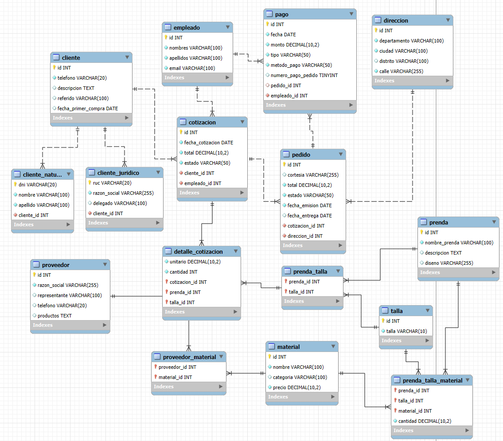

# Métodos Cuantitativos - Base de Datos

Sistema de gestión de base de datos para administración de pedidos, cotizaciones, inventario y clientes de una empresa de confección de prendas.

## Diagrama de Base de Datos



El diagrama muestra las relaciones entre todas las entidades del sistema, incluyendo clientes, empleados, pedidos, cotizaciones, prendas, materiales y más.

## 📋 Requisitos Previos

- Node.js (v16 o superior)
- MySQL (v8.0 o superior)
- pnpm (gestor de paquetes)

## 🚀 Instalación

1. Clona el repositorio:

```bash
git clone https://github.com/devEddu17x/metodos-cuantitativos-bd.git
cd metodos-cuantitativos-bd
```

2. Instala las dependencias usando **pnpm** (no npm):

```bash
pnpm install
```

3. Configura las variables de entorno creando un archivo `.env`:

```env
MYSQL_HOST=localhost
MYSQL_USER=tu_usuario
MYSQL_PASSWORD=tu_contraseña
MYSQL_DATABASE=metodos_cuantitativos_dumi
```

## 📦 Scripts Disponibles

El proyecto utiliza los siguientes scripts en `package.json`:

### Scripts de Base de Datos

```bash
# Limpiar completamente la base de datos (DROP DATABASE)
pnpm clean

# Crear el esquema de la base de datos (tablas, relaciones, etc.)
pnpm seed:schema

# Ejecutar todos los seeders (poblar todas las tablas)
pnpm seed:manager
```

### Scripts de Entidades Individuales

```bash
# Sembrar solo empleados
pnpm seed:employees

# Sembrar solo clientes
pnpm seed:clients

# Sembrar solo prendas
pnpm seed:prendas

# ... otros seeders individuales
```

## 🗂️ Estructura del Proyecto

```
metodos-cuantitativos-bd/
├── src/
│   ├── config.ts                    # Configuración de conexión a MySQL
│   ├── cleaner.ts                   # Script para eliminar la BD
│   ├── schema-creation.seed.ts      # Script de creación del esquema
│   ├── manager.seed.ts              # Orquestador de todos los seeders
│   └── entities/                    # Seeders individuales por entidad
│       ├── employees.seed.ts
│       ├── clients.seed.ts
│       ├── prendas.seed.ts
│       ├── materiales.seed.ts
│       └── ...
├── package.json
├── tsconfig.json
└── .env
```

## 🤝 Cómo Contribuir

### 1. Creación de Seeders de Entidades

Los seeders de entidades deben seguir estas reglas:

#### ✅ Principios de Diseño

1. **Independencia**: Cada seeder debe poder ejecutarse de forma individual
2. **Modularidad**: Los archivos deben estar en `src/entities/`
3. **Reutilización**: Deben poder ser invocados por el `manager.seed.ts`
4. **Autocontenidos**: Deben manejar su propia conexión y errores
5. **Volumen de datos**: Cada tabla debe tener **al menos 100 registros** para pruebas realistas
   - ⚠️ **Excepciones**: Tablas de catálogo como `talla` pueden tener cantidad variable según necesidad del negocio

#### 📝 Plantilla de Seeder Individual

Crea un archivo en `src/entities/nombre-entidad.seed.ts`:

```typescript
import { pool } from "../config";

export async function seedNombreEntidad() {
  const connection = await pool.getConnection();

  try {
    console.log("🌱 Seeding nombre_entidad...");

    // Tu lógica de inserción aquí
    await connection.query(
      `
      INSERT INTO nombre_entidad (campo1, campo2) VALUES
      (?, ?),
      (?, ?)
    `,
      [valor1, valor2, valor3, valor4]
    );

    console.log("✅ nombre_entidad seeded successfully!");
  } catch (error) {
    console.error("❌ Error seeding nombre_entidad:", error);
    throw error;
  } finally {
    connection.release();
  }
}

// Permitir ejecución independiente
if (require.main === module) {
  seedNombreEntidad()
    .then(() => {
      console.log("Seeding completed");
      process.exit(0);
    })
    .catch((error) => {
      console.error("Seeding failed:", error);
      process.exit(1);
    });
}
```

#### 🔧 Ejemplo Práctico: Seeder de Empleados

**Archivo**: `src/entities/employees.seed.ts`

```typescript
import { pool } from "../config";
import { faker } from "@faker-js/faker";

export async function seedEmployees() {
  const connection = await pool.getConnection();

  try {
    console.log("🌱 Seeding empleados...");

    const employees = [];
    for (let i = 0; i < 100; i++) {
      employees.push([
        faker.person.firstName(),
        faker.person.lastName(),
        faker.internet.email(),
      ]);
    }

    await connection.query(
      `INSERT INTO empleado (nombres, apellidos, email) VALUES ?`,
      [employees]
    );

    console.log("✅ 100 empleados insertados!");
  } catch (error) {
    console.error("❌ Error seeding empleados:", error);
    throw error;
  } finally {
    connection.release();
  }
}

// Permite ejecutar: pnpm tsx src/entities/employees.seed.ts
if (require.main === module) {
  seedEmployees()
    .then(() => {
      console.log("Seeding completed");
      process.exit(0);
    })
    .catch((error) => {
      console.error("Seeding failed:", error);
      process.exit(1);
    });
}
```

**Uso**:

- **Individual**: `pnpm tsx src/entities/employees.seed.ts`
- **Desde manager**: Se importa y ejecuta dentro de `manager.seed.ts`

#### 🎯 Agregar al Manager

**Archivo**: `src/manager.seed.ts`

```typescript
import { seedEmployees } from "./entities/employees.seed";
import { seedClients } from "./entities/clients.seed";
import { seedPrendas } from "./entities/prendas.seed";

async function runAllSeeders() {
  try {
    console.log("🚀 Starting all seeders...\n");

    // Sembrar en orden de dependencias
    await seedEmployees();
    await seedClients();
    await seedPrendas();
    // ... otros seeders

    console.log("\n✅ All seeders completed successfully!");
  } catch (error) {
    console.error("\n❌ Seeding process failed:", error);
    process.exit(1);
  }
}

runAllSeeders();
```

#### 📌 Agregar Script en package.json

```json
{
  "scripts": {
    "seed:employees": "tsx src/entities/employees.seed.ts",
    "seed:clients": "tsx src/entities/clients.seed.ts",
    "seed:manager": "tsx src/manager.seed.ts"
  }
}
```

### 3. Orden de Dependencias

Al crear seeders, respeta el orden de las relaciones de foreign keys:

1. **Entidades independientes** (sin FK):

   - `empleado` → **100+ registros**
   - `direccion` → **100+ registros**
   - `cliente` → **100+ registros**
   - `prenda` → **100+ registros**
   - `talla` → **Variable** (catálogo estándar) ⚠️ Excepción
   - `material` → **100+ registros**
   - `proveedor` → **100+ registros**

2. **Entidades con FK de nivel 1**:

   - `cliente_natural` (depende de `cliente`) → **50+ registros**
   - `cliente_juridico` (depende de `cliente`) → **50+ registros**
   - `pago` (depende de `empleado`) → **100+ registros**
   - `prenda_talla` (depende de `prenda` y `talla`) → **200+ registros**

3. **Entidades con FK de nivel 2+**:
   - `cotizacion` (depende de `cliente` y `empleado`) → **100+ registros**
   - `pedido` (depende de `cotizacion` y `direccion`) → **100+ registros**
   - `detalle_cotizacion` (depende de `cotizacion` y `prenda_talla`) → **200+ registros**

### 4. Volumen de Datos Recomendado

Para garantizar pruebas realistas y rendimiento adecuado:

| Tabla                | Registros Mínimos | Notas                                                    |
| -------------------- | ----------------- | -------------------------------------------------------- |
| `empleado`           | 100               | Datos de personal                                        |
| `cliente`            | 100               | Base de clientes                                         |
| `cliente_natural`    | 50-70             | Personas naturales                                       |
| `cliente_juridico`   | 30-50             | Empresas                                                 |
| `direccion`          | 100               | Direcciones de entrega                                   |
| `prenda`             | 100               | Catálogo de productos                                    |
| `talla`              | Variable          | **Excepción**: Catálogo estándar (XS, S, M, L, XL, etc.) |
| `material`           | 100               | Inventario de materiales                                 |
| `proveedor`          | 100               | Proveedores                                              |
| `prenda_talla`       | 200+              | Combinaciones prenda-talla                               |
| `cotizacion`         | 100               | Cotizaciones generadas                                   |
| `pedido`             | 100               | Pedidos confirmados                                      |
| `pago`               | 100+              | Transacciones                                            |
| `detalle_cotizacion` | 200+              | Ítems en cotizaciones                                    |

**📊 Total estimado**: ~1,500 - 2,000 registros en toda la base de datos

### 5. Uso de Faker para Datos de Prueba

Instala faker si aún no está:

```bash
pnpm add @faker-js/faker
```

Ejemplos de uso:

```typescript
import { faker } from "@faker-js/faker";

// Datos personales
faker.person.firstName(); // "María"
faker.person.lastName(); // "González"
faker.internet.email(); // "maria@example.com"
faker.phone.number(); // "+51 987 654 321"

// Datos de negocio
faker.company.name(); // "Textiles SAC"
faker.commerce.productName(); // "Polo Deportivo"
faker.commerce.price(); // "89.99"

// Fechas
faker.date.past(); // Fecha pasada
faker.date.future(); // Fecha futura
```

## 🔄 Flujo Completo de Desarrollo

```bash
# 1. Limpiar la base de datos
pnpm clean

# 2. Crear el esquema
pnpm seed:schema

# 3. Sembrar todos los datos
pnpm seed:manager

# O sembrar entidades específicas
pnpm seed:employees
pnpm seed:prendas
```

## 📊 Diagrama de Base de Datos

El proyecto implementa el siguiente esquema relacional (ver diagrama adjunto en el repositorio).

Principales tablas:

- **empleado**: Datos de empleados
- **cliente**: Clientes (base)
  - **cliente_natural**: Clientes personas naturales
  - **cliente_juridico**: Clientes personas jurídicas
- **prenda**: Catálogo de prendas
- **talla**: Tallas disponibles
- **material**: Materiales para confección
- **cotizacion**: Cotizaciones de pedidos
- **pedido**: Pedidos confirmados
- **pago**: Registro de pagos
- **direccion**: Direcciones de entrega

## 🛠️ Tecnologías Utilizadas

- **TypeScript**: Lenguaje de programación
- **MySQL2**: Cliente de MySQL para Node.js
- **Faker.js**: Generación de datos de prueba
- **dotenv**: Manejo de variables de entorno
- **pnpm**: Gestor de paquetes (¡NO usar npm!)

## ⚠️ Notas Importantes

- **Usar SIEMPRE pnpm**, no npm ni yarn
- Los seeders en `src/entities/` DEBEN exportar su función principal
- Los seeders DEBEN poder ejecutarse tanto individualmente como desde el manager
- Respeta el orden de dependencias al sembrar datos
- No comitear el archivo `.env` (ya está en `.gitignore`)

## 📝 Convenciones de Código

- Usar nombres descriptivos en inglés para funciones y variables
- Mensajes de consola con emojis para mejor UX:
  - 🌱 Para inicio de seeding
  - ✅ Para éxito
  - ❌ Para errores
  - 🚀 Para inicio de procesos
- Manejar errores apropiadamente con try-catch
- Liberar conexiones en el bloque `finally`

## 📞 Contacto

Para dudas o sugerencias, abre un issue en GitHub o contacta al equipo de desarrollo.

---

**¡Gracias por contribuir! 🎉**
